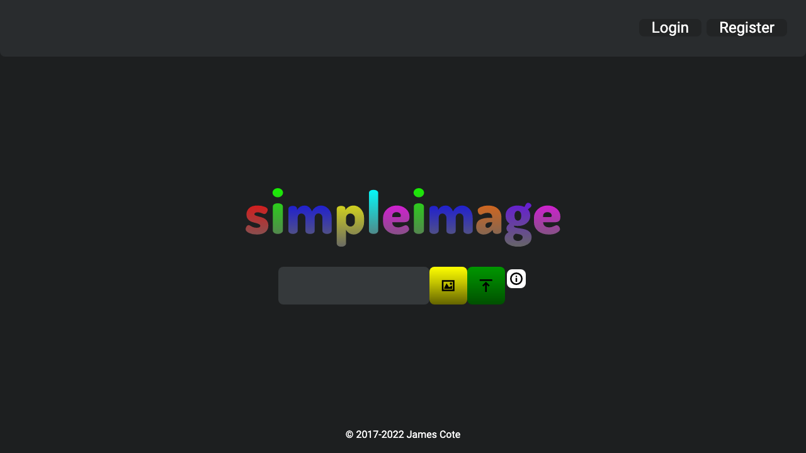

# 

[](https://circleci.com/gh/Coteh/simpleimage)
[](https://gitpod.io/#https://github.com/Coteh/simpleimage)

A simple image hosting web application that I created and implemented using Node.js and Express, with MongoDB as the database and Redis as the session store.



## Features

* Upload BMP, PNG, JPEG, and GIF images
* Comment on images
* Image page
    * Image upload date
    * Total number of comments on image
* Delete your images (Must have an account)
* User profile page
    * Join date
    * Comment history and total number of comments posted
* User settings
    * Change password
* Rotates JPEG images based on Orientation tag in EXIF metadata
* Strips EXIF metadata from JPEG images

## Installation

### .env Template

```
MONGODB_URI=<MongoDB URI goes here>
REDIS_URL=<Redis URL goes here>
MONGO_ROOT_USERNAME=<root username for MongoDB instance>
MONGO_ROOT_PASSWORD=<root password for MongoDB instance>
MONGO_INITIAL_DATABASE=<initial database for MongoDB instance>

SESSION_SECRET=<session secret goes here>
GA_TRACKING_ID=<Google Analytics Tracking ID (Universal Analytics)>
LOGIN_TO_UPLOAD=true  # omit this variable if you don't want to require users to login to upload
FILE_SIZE_LIMIT=5000000 # omit this variable if you want the default file size limit of 500 MB

EVALUATION_MODE=true # omit this variable to disable automatic removal of images
EXPIRE_AFTER_SECONDS=300 # set this to set time for the images to be stored in database in evaluation mode (default is 300 if unspecified)

SENTRY_DSN=<Sentry DSN>                     # endpoint to upload Sentry events
SENTRY_AUTH_TOKEN=<Sentry Auth Token>       # used for uploading source maps to Sentry
SENTRY_ORG=<Sentry Organization (slug)>     # used for associating the Sentry organization to upload source maps to
```

### Building and Running Locally

~~~sh
# Install dependencies
npm install

# Build web components with webpack (and watch for changes when in development mode)
npm run build:client

# Run local MongoDB database
mongod --dbpath ./data/

# Export SESSION_SECRET environment variable (or use a .env file)
export SESSION_SECRET="my-secret"

# Run the app
npm start
# or, run the app in development mode
npm run start:dev

# Navigate to http://localhost:3010 on your browser
~~~

### Serving with Docker

View [Makefile](Makefile) to see what each `make` command does.

#### Development

~~~sh
# Build Docker images
make build-dev              # make bd

# Run Docker containers in Docker Compose environment
make deploy-dev             # make dd
# or, run the following if you want to use the Node.js debugger as well (port 9229)
make deploy-dev-debug       # make ddd

# Navigate to http://localhost:8080 on your browser
~~~

#### Production

~~~sh
# Build Docker images
make build-prod             # make bp

# Run Docker containers in Docker Compose environment
make deploy-prod            # make dp
~~~

#### Unit/Integration Tests

~~~sh
# Build Docker images for test
make build-test             # make bt

# Run Docker containers for test in Docker Compose environment
make deploy-test            # make dt
# or, run the following if you want to use the Node.js debugger as well (port 9229 - will wait for debugger to be attached before starting)
make deploy-test-debug       # make dtd

# to test a specific file, pass it like the example below: (can also be passed into deploy-test-debug)
make deploy-test TEST_FILE=./test/integ/image_delete_integ_test.js
~~~

#### Cypress E2E Tests

```sh
# Build Docker images for E2E testing (E2E tests use production environment)
make build-prod             # make bp

# Run Docker containers for E2E testing in Docker Compose environment
make deploy-test-server     # make dts

# Install dev dependencies (includes Cypress)
npm install

# Run Cypress for E2E testing
npm run test:e2e
# Run Cypress with UI interface (for local testing)
npm run test:cypress
```

#### Use HTTPS in dev

Using [mkcert](https://github.com/FiloSottile/mkcert):

```sh
mkdir ssl
cd ssl

mkcert -install

mkcert localhost 127.0.0.1 ::1
```

To run development environment using dev HTTPS certs:

```sh
make deploy-dev-https       # make dds
```

#### Clean Docker images and volumes

```sh
make clean
```

## Known Limitations

* Cannot change username/email
* Some of the popup dialogs need a bit of size tweaking (e.g. signup dialog)
* No image upload history (Currently being worked on in [dev/image-history branch](https://github.com/Coteh/simpleimage/tree/dev/image-history))
* No option for anonymous users to upload an image with ability to delete
    * Delete links based on user session are being considered (which is what imgur does as well)
* See [Issues](https://github.com/Coteh/simpleimage/issues) page for more

## Future Additions

* User preferences menu
* Ability to change email and/or username
* Image galleries
* Custom image IDs
* Delete account
